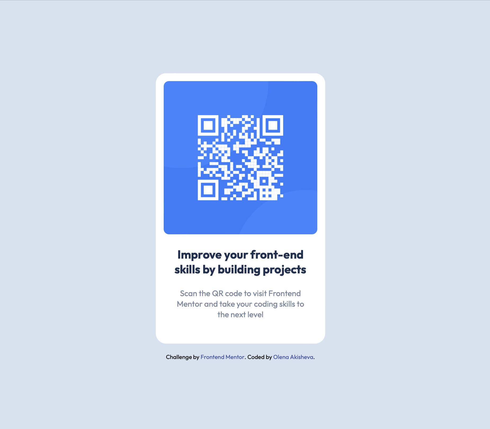

# Frontend Mentor - QR code component solution

This is a solution to the [QR code component challenge on Frontend Mentor](https://www.frontendmentor.io/challenges/qr-code-component-iux_sIO_H). Frontend Mentor challenges help you improve your coding skills by building realistic projects. 

### Screenshot

### Links

- Solution URL: [https://github.com/Akisheva/QR-code.git](https://github.com/Akisheva/QR-code.git)
- Live Site URL: [qr-code-challenge-akisheva.netlify.app](qr-code-challenge-akisheva.netlify.app)

### Built with

- Semantic HTML5 markup
- CSS custom properties

## Author

- Frontend Mentor - [@Akisheva](https://www.frontendmentor.io/profile/Akisheva)
- LinkedIn - [Olena Akisheva](https://www.linkedin.com/in/elena-akisheva-242b0b23b/)
